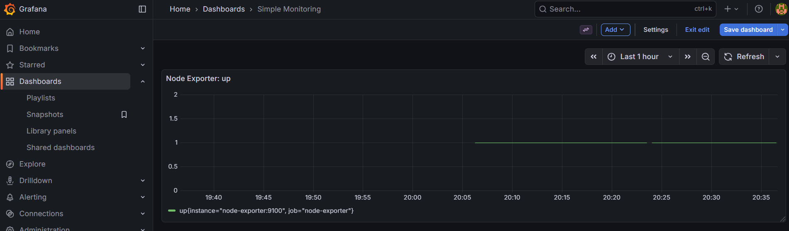

# Project 1 — Monitoring

Purpose

- Demonstrate a small Prometheus + Grafana monitoring stack and show service metrics and alerting examples.

Primary tech

- Docker Compose, Prometheus, Grafana, Node Exporter, (optionally) Alertmanager

Run / Demo

1. Start the compose stack:

```powershell
# from the repo root (cross-platform):
cd projects/project-1-monitoring
docker compose up -d

# OR use an absolute path on your machine (replace with your path):
# cd "C:/path/to/pts-projects-repo/projects/project-1-monitoring"
# docker compose up -d
```

2. Open Grafana at `http://localhost:3000` and Prometheus at `http://localhost:9090`.
 
Screenshots




